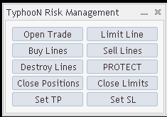
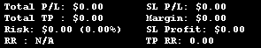
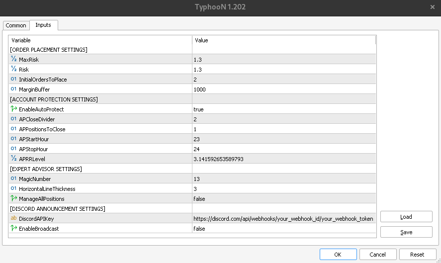

## TyphooN's MQL5-Risk_Management_System (Expert)

## TyphooN's MQL5-Risk_Management_System (Expert) Settings

### ORDER PLACEMENT SETTINGS
-MaxRisk: Maximum percentage of risk across the symbol, once this level is hit no more orders will be placed.

-Risk: The % of the account that is being risked every time "Open Trade" is clicked.

-InitialOrdersToPlace: This is the number of orders placed when there are 0 orders on the current symbol.  Risk will be divided amongst the orders.  If another position is open on the symbol, then only 1 order will be placed.

### ACCOUNT PROTECTION SETTINGS

-EnableAutoProtect will place stop loss(es) at break even when RR passes AutoProtectRRLevel and risk > 0.  This will only happen once per market, and will not happen again if SL is set to break even on any position for that symbol.

-APCloseDivider: The number of positions that have to be open in order for trades to automatically take profit on APPositionsToClose position(s), and set the rest to break even stop loss.

-APPositionsToClose: The number of positions to close in profit when AutoProtect is triggered.

-APStartHour: The server hour when AutoProtect can start to be active.  By default it is active from 20 -> 24 server time (last 4 hour candlestick of the day).  Can be set to 0 to start at the beginning of the day.

-APStopHour: The server hour when AutoProtect can stops being active.  By default it is active from 20 -> 24 server time (last 4 hour candlestick of the day).  Can be set to 24 to be active until the end of the day.

-AutoProtectRRLevel is the Reward:Risk level that will trigger AutoProtect.

### POSITION MANAGEMENT SETTINGS

- SLPips - The Red Stop Loss Line will be placed SLPips distance away from the Bid price.
  
- TPPips - The Green Take Profit Line will be placed TPPips distance away from the Ask price.

### EXPERT ADVISOR SETTINGS

-MagicNumber (can be set to anything the user wants, but this expert will only modify trades/positions that match the MagicNumber on the chart).

-HorizontalLineThickness - How thick in pixels SL, TP, and Limit lines are drawn with.

-ManageAllPositions - By default is set to false which will only manage positions that have been opened by the EA's MagicNumber.  If set to true, will manage all positions on a symbol.

### Usage

This project is intended and may be freely used for education and entertainment purposes.
However, **this project is not suitable for live trading** without relevant knowledge.

### License

The project is released under [GNU GPLv3 licence](https://www.gnu.org/licenses/quick-guide-gplv3.html),
so that means the software is copyrighted, however you have the freedom to use, change or share the software
for any purpose as long as the modified version stays free. See: [GNU FAQ](https://www.gnu.org/licenses/gpl-faq.html).

You should have received a copy of the GNU General Public License along with this program
(check the [LICENSE] file).
If not, please read <http://www.gnu.org/licenses/>.
For simplified version, please read <https://tldrlegal.com/license/gnu-general-public-license-v3-(gpl-3)>.

## Terms of Use

By using this software, you understand and agree that we (company and author)
are not be liable or responsible for any loss or damage due to any reason.
Although every attempt has been made to assure accuracy,
we do not give any express or implied warranty as to its accuracy.
We do not accept any liability for error or omission.

You acknowledge that you are familiar with these risks
and that you are solely responsible for the outcomes of your decisions.
We accept no liability whatsoever for any direct or consequential loss arising from the use of this product.
You understand and agree that past results are not necessarily indicative of future performance.

Use of this software serves as your acknowledgement and representation that you have read and understand
these TERMS OF USE and that you agree to be bound by such Terms of Use ("License Agreement").

### Copyright information

Copyright © 2023 - Decapool.net - All Rights Reserved

### Disclaimer and Risk Warnings

Trading any financial market involves risk.
All forms of trading carry a high level of risk so you should only speculate with money you can afford to lose.
You can lose more than your initial deposit and stake.
Please ensure your chosen method matches your investment objectives,
familiarize yourself with the risks involved and if necessary seek independent advice.

NFA and CTFC Required Disclaimers:
Trading in the Foreign Exchange market as well as in Futures Market and Options or in the Stock Market
is a challenging opportunity where above average returns are available for educated and experienced investors
who are willing to take above average risk.
However, before deciding to participate in Foreign Exchange (FX) trading or in Trading Futures, Options or stocks,
you should carefully consider your investment objectives, level of experience and risk appetite.
**Do not invest money you cannot afford to lose**.

CFTC RULE 4.41 - HYPOTHETICAL OR SIMULATED PERFORMANCE RESULTS HAVE CERTAIN LIMITATIONS.
UNLIKE AN ACTUAL PERFORMANCE RECORD, SIMULATED RESULTS DO NOT REPRESENT ACTUAL TRADING.
ALSO, SINCE THE TRADES HAVE NOT BEEN EXECUTED, THE RESULTS MAY HAVE UNDER-OR-OVER COMPENSATED FOR THE IMPACT,
IF ANY, OF CERTAIN MARKET FACTORS, SUCH AS LACK OF LIQUIDITY. SIMULATED TRADING PROGRAMS IN GENERAL
ARE ALSO SUBJECT TO THE FACT THAT THEY ARE DESIGNED WITH THE BENEFIT OF HINDSIGHT.
NO REPRESENTATION IS BEING MADE THAN ANY ACCOUNT WILL OR IS LIKELY TO ACHIEVE PROFIT OR LOSSES SIMILAR TO THOSE SHOWN.
