# MQL5 NNFX Risk Management System

A comprehensive MQL5/MQL4 trading toolkit featuring manual risk management, automated NNFX confluence trading, multi-timeframe technical indicators, and institutional-grade VaR position sizing.

**Website:** [MarketWizardry.org](https://www.marketwizardry.org/)

---

## Table of Contents
- [Components Overview](#components-overview)
- [Architecture](#architecture)
- [Expert Advisors](#expert-advisors)
  - [TyphooN Risk Management EA](#typhoon-risk-management-ea-v1403)
  - [TyAlgo NNFX Confluence EA](#tyalgo-nnfx-confluence-ea-v2106)
- [Indicators](#indicators)
  - [MTF_MA — Multi Timeframe Moving Average](#mtf_ma--multi-timeframe-moving-average-v1078)
  - [MultiKAMA — Multi Timeframe KAMA](#multikama--multi-timeframe-kama-v1009)
  - [KAMA — Kaufman Adaptive Moving Average](#kama--kaufman-adaptive-moving-average-v103)
  - [Ehlers Fisher Transform](#ehlers-fisher-transform)
  - [BetterVolume — Volume Classification](#bettervolume--volume-classification)
  - [SupplyDemand — Supply and Demand Zones](#supplydemand--supply-and-demand-zones)
  - [ATR Projection](#atr-projection-v1052)
  - [Previous Candle Levels](#previous-candle-levels-v1056)
  - [FakeCandle](#fakecandle-v105)
- [Include Libraries](#include-libraries)
- [Installation](#installation)
- [Deployment](#deployment)
- [Cross-Platform Support](#cross-platform-support)
- [License](#license)
- [Disclaimer](#disclaimer)

---

## Components Overview

| Component | Type | Version | Platform | Description |
|-----------|------|---------|----------|-------------|
| TyphooN | EA | 1.403 | MQL5 | Manual risk management with GUI panel |
| TyAlgo | EA | 2.106 | MQL5 | Automated NNFX confluence trading |
| MTF_MA | Indicator | 1.078 | MQL5/MQL4 | Multi-timeframe SMA bull/bear power dashboard |
| MultiKAMA | Indicator | 1.009 | MQL5/MQL4 | Multi-timeframe KAMA overlay |
| KAMA | Indicator | 1.03 | MQL5/MQL4 | Kaufman Adaptive Moving Average |
| EhlersFisherTransform | Indicator | 1.002 | MQL5/MQL4 | Fisher Transform oscillator with bias GV |
| BetterVolume | Indicator | 1.00 | MQL5/MQL4 | Volume classification histogram (climax/churn/low) |
| SupplyDemand | Indicator | 1.00 | MQL5/MQL4 | Supply and demand zone detection |
| ATR_Projection | Indicator | 1.052 | MQL5/MQL4 | ATR projection lines on chart |
| PreviousCandleLevels | Indicator | 1.056 | MQL5/MQL4 | Previous candle high/low levels |
| FakeCandle | Indicator | 1.05 | MQL5/MQL4 | Draws a user-defined candle on chart |

---

## Architecture

### Inter-Process Communication (IPC)

Indicators and EAs communicate through **MT5 GlobalVariables** — a shared key-value store that persists across chart windows. Each indicator writes signal data to named GlobalVariables, which EAs read on each tick or new bar.

```
┌─────────────────┐     GlobalVariables      ┌──────────────┐
│  MultiKAMA      │───▶ IsAbove_KAMA_{TF}  ──▶│              │
│  EhlersFisher   │───▶ FisherBias         ──▶│  TyAlgo EA   │
│  MTF_MA         │───▶ GlobalBullPowerHTF ──▶│  (reads GVs) │
│                 │───▶ GlobalBearPowerHTF ──▶│              │
│  BetterVolume   │    (chart reference)      │              │
└─────────────────┘                           └──────────────┘
```

**GlobalVariable names used:**

| GlobalVariable | Written By | Read By | Values |
|----------------|-----------|---------|--------|
| `IsAbove_KAMA_H1` .. `_MN1` | MultiKAMA | TyAlgo (Baseline slot) | 1.0 = price above, 0.0 = below |
| `recent_KAMA_H1` .. `_MN1` | MultiKAMA | — | Latest KAMA value per timeframe |
| `FisherBias` | EhlersFisherTransform | TyAlgo (Confirm/Exit slot) | +1.0 = bullish, -1.0 = bearish, 0.0 = neutral |
| `GlobalBullPowerHTF` | MTF_MA | TyAlgo (Confirm slot) | HTF bull power score (0-100) |
| `GlobalBearPowerHTF` | MTF_MA | TyAlgo (Confirm slot) | HTF bear power score (0-100) |
| `GlobalBullPowerLTF` | MTF_MA | — | LTF bull power score (0-100) |
| `GlobalBearPowerLTF` | MTF_MA | — | LTF bear power score (0-100) |

### File Structure

```
├── Experts/
│   ├── TyphooN.mq5           # Manual risk management EA
│   └── TyAlgo.mq5            # NNFX confluence algo EA
├── Indicators/
│   ├── MTF_MA.mq5/.mq4/.mqh        # Multi-TF SMA dashboard
│   ├── MultiKAMA.mq5/.mq4/.mqh     # Multi-TF KAMA
│   ├── KAMA.mq5/.mq4/.mqh          # Single KAMA
│   ├── EhlersFisherTransform.mq5/.mq4/.mqh  # Fisher Transform
│   ├── BetterVolume.mq5/.mq4/.mqh  # Volume classification histogram
│   ├── SupplyDemand.mq5/.mq4/.mqh  # Supply and demand zones
│   ├── ATR_Projection.mq5/.mq4/.mqh  # ATR projection lines
│   ├── PreviousCandleLevels.mq5/.mq4/.mqh  # Candle levels
│   └── FakeCandle.mq5/.mq4/.mqh    # Fake candle overlay
├── Include/
│   ├── Darwinex/
│   │   └── DWEX Portfolio Risk Man.mqh  # VaR calculations
│   ├── Orchard/
│   │   └── RiskCalc.mqh       # Risk utility functions
│   └── TyAlgo/
│       └── SignalSlots.mqh    # Modular signal slot system
│   └── Retired/                # Legacy indicators (RVOL, shved — not deployed)
├── Images/                    # Screenshots for documentation
├── deploy.sh                  # Deploy to all MT5 installations
└── README.md
```

---

## Expert Advisors

### TyphooN Risk Management EA (v1.403)

A manual trading EA with a GUI panel for order placement, position management, and risk monitoring. Supports four risk modes, martingale hedging with TRIM/HARVEST/PROTECT tiers, equity protection, and Discord trade announcements.

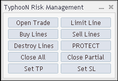
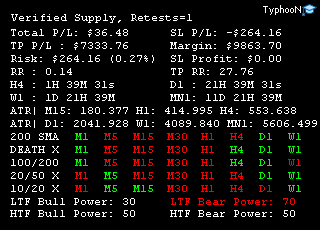

#### Risk Management Panel Buttons
- **Open Trade**: Market execution. SL/TP set to red/green lines on chart.
- **Buy Lines / Sell Lines**: Creates TP (green) and SL (red) lines. Locks to existing position levels if present.
- **Destroy Lines**: Removes SL/TP lines from chart.
- **Close All**: Closes all positions and pending orders on the symbol.
- **Close Partial**: Closes the smallest lot position on the symbol.
- **Set TP / Set SL**: Modifies existing positions' TP or SL to the current line level.
- **HARVEST**: Toggles HARVEST tier on/off (only active when Martingale is Long or Short).
- **Martingale**: Toggles martingale hedge mode (Long/Short/Unwind/Off).

#### Dashboard InfoText
- **Total P/L**: Current running profit/loss on the symbol.
- **Risk / SL P/L**: Dollar risk at stop loss, as absolute and percent of balance.
- **TP P/L / TP RR**: Projected profit at take-profit and reward:risk ratio.
- **RR**: Current reward:risk ratio based on live price.
- **VaR %**: Value at Risk as percentage of equity.
- **H4/D1/W1/MN1 Timers**: Countdown to next candle on each timeframe.

#### Settings

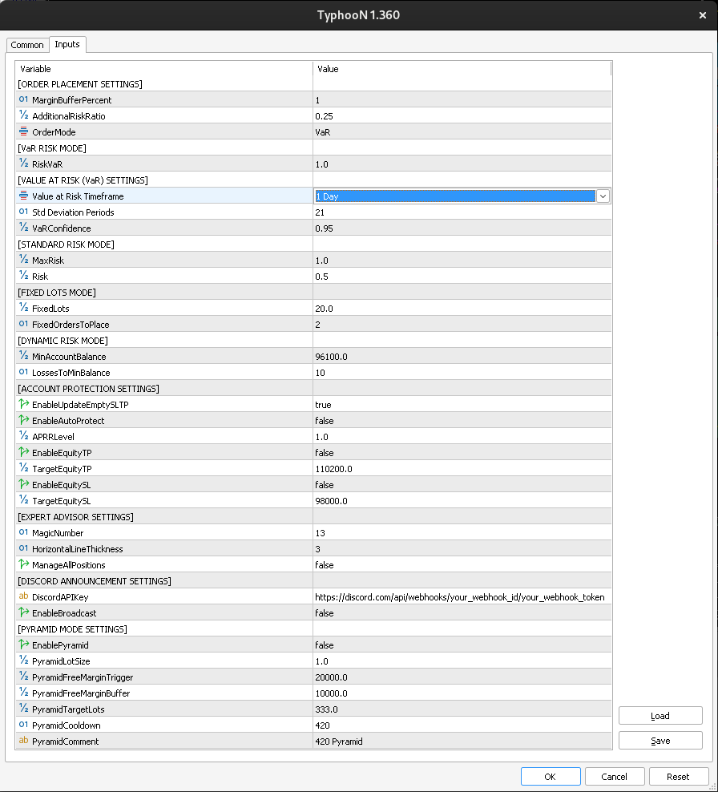

##### Expert Advisor Settings
| Parameter | Default | Description |
|-----------|---------|-------------|
| MagicNumber | 13 | Unique ID — EA only manages positions with matching magic number |
| HorizontalLineThickness | 3 | Pixel width of SL/TP lines |
| ManageAllPositions | false | If true, manages all positions regardless of magic number |
| FontSize | 8 | Dashboard info text font size |

##### Order Placement Settings
| Parameter | Default | Description |
|-----------|---------|-------------|
| MarginBufferPercent | 1 | Percentage of margin reserved as buffer |
| AdditionalRiskRatio | 0.25 | Multiplier for additional lots when SL at break-even |
| OrderMode | VaR | Risk mode: Standard, Fixed, Dynamic, or VaR |

##### VaR Risk Mode
| Parameter | Default | Description |
|-----------|---------|-------------|
| VaRRiskMode | PercentVaR | PercentVaR (% of equity) or NotionalVaR (fixed $) |
| RiskVaRPercent | 0.9 | Target VaR as % of equity |
| RiskVaRNotional | 9001 | Fixed dollar VaR target |
| VaRTimeframe | D1 | Timeframe for return calculations |
| StdDevPeriods | 21 | Lookback for standard deviation |
| VaRConfidence | 0.95 | Confidence level (Darwinex standard: 95% over 21 days) |

##### Standard Risk Mode
| Parameter | Default | Description |
|-----------|---------|-------------|
| MaxRisk | 1.0 | Maximum total risk % across the symbol |
| Risk | 0.5 | Risk % per trade |

##### Fixed Lots Mode
| Parameter | Default | Description |
|-----------|---------|-------------|
| FixedLots | 20 | Lots per order |
| FixedOrdersToPlace | 2 | Number of orders per click |

##### Dynamic Risk Mode
| Parameter | Default | Description |
|-----------|---------|-------------|
| MinAccountBalance | 96100 | Floor balance for risk calculation |
| LossesToMinBalance | 10 | `Risk = (Balance - MinBalance) / LossesToMinBalance` |

##### Account Protection
| Parameter | Default | Description |
|-----------|---------|-------------|
| EnableUpdateEmptySLTP | false | Auto-copy SL/TP from another same-direction position |
| EnableEquityTP | false | Close all positions when equity >= target |
| TargetEquityTP | 110200 | Equity take-profit level |
| EnableEquitySL | false | Close all positions when equity < target |
| TargetEquitySL | 98000 | Equity stop-loss level |

##### Martingale Mode
| Parameter | Default | Description |
|-----------|---------|-------------|
| MartingaleCloseChunkSize | 50 | Lots per partial close (profit banking + PROTECT) |
| MartingaleCooldown | 30 | Seconds between margin-based operations |
| MartingaleEquityTP | 0 | Profit target in $ (0 = disabled) |
| MartingaleUnwindLotSize | 1 | TRIM: lots per hedge unwind close |
| MartingaleUnwindMarginPct | 0 | TRIM: unwind hedges above this margin % (0 = off) |
| MartingaleDangerMarginPct | 0 | PROTECT: emergency bias close above this margin % (0 = off) |
| MartingaleHarvestMarginPct | 0 | HARVEST: bank profits on most profitable bias above this margin % (0 = off) |
| MartingaleHarvestLotSize | 1 | HARVEST: lots per harvest close |

##### Discord Announcements
| Parameter | Default | Description |
|-----------|---------|-------------|
| DiscordAPIKey | (webhook URL) | Discord webhook for trade alerts |
| EnableBroadcast | false | Enable trade announcements |

---

### TyAlgo NNFX Confluence EA (v2.106)

An automated trading EA implementing the NNFX (No Nonsense Forex) method with a modular signal slot architecture. Each indicator role (Baseline, Confirmation, Volume, Exit) is a configurable "slot" that users can swap via dropdown menus or extend with custom GlobalVariables — no code changes required.

#### Signal Slot Architecture

The EA uses 5 signal slots, each independently configurable:

| Slot | Role | Default | Options |
|------|------|---------|---------|
| Baseline | Trend filter | BL_KAMA (D1) | None, KAMA, Custom GV |
| Confirmation 1 | Entry signal | CF_FISHER | None, Fisher, MTF MA, Custom GV |
| Confirmation 2 | Entry signal | CF_MTF_MA | None, Fisher, MTF MA, Custom GV |
| Volume | Volume filter | VL_BETTER_VOL | None, BetterVolume, RVOL (retired), Custom GV |
| Exit | Exit signal | EX_FISHER | None, Fisher, Custom GV |

**Signal Convention:**
- Directional slots: `+1` = buy, `-1` = sell, `0` = neutral (blocks entry)
- Volume slot: `1` = pass, `0` = filtered out
- Disabled slots (`_NONE`) are excluded from consensus

**Consensus Engine:**
1. All active directional slots must agree on direction
2. Any active slot returning neutral (0) blocks entry
3. Volume must pass (if volume slot active)
4. Exit slot operates independently — closes positions on reversal

**Custom GV Contract:** Any indicator can participate by writing to a GlobalVariable:
- Directional: write `+1.0` / `-1.0` / `0.0`
- Volume: write `> 0` for pass

#### Settings

##### Baseline Slot
| Parameter | Default | Description |
|-----------|---------|-------------|
| BaselineType | BL_KAMA | Baseline indicator selection |
| BL_KAMA_TF | D1 | KAMA timeframe (when BL_KAMA) |
| BL_CustomGV | "" | GlobalVariable name (when BL_CUSTOM_GV) |

##### Confirmation Slots (1 and 2)
| Parameter | Default C1 | Default C2 | Description |
|-----------|-----------|-----------|-------------|
| ConfirmType | CF_FISHER | CF_MTF_MA | Confirmation indicator |
| MTF_MinBullHTF | 10 | 10 | Bull power threshold (CF_MTF_MA) |
| MTF_MinBearHTF | 10 | 10 | Bear power threshold (CF_MTF_MA) |
| CustomGV | "" | "" | GlobalVariable name (CF_CUSTOM_GV) |

##### Volume Slot
| Parameter | Default | Description |
|-----------|---------|-------------|
| VolumeType | VL_BETTER_VOL | Volume indicator: BetterVolume (pass if not Low Vol), Custom GV, or None |
| VL_MinRVOL | 0.8 | Minimum RVOL to pass filter (legacy, only with VL_RVOL) |
| VL_RVOL_Days | 10 | RVOL averaging period (legacy, only with VL_RVOL) |

##### Exit Slot
| Parameter | Default | Description |
|-----------|---------|-------------|
| ExitType | EX_FISHER | Exit signal indicator |
| EX_CustomGV | "" | GlobalVariable name (EX_CUSTOM_GV) |

##### Position Sizing and Entry
| Parameter | Default | Description |
|-----------|---------|-------------|
| MagicNumber | 42 | Unique position identifier |
| RiskVaRPercent | 1 | VaR target as % of equity |
| ATR_Period | 14 | ATR period for SL/TP calculation |
| SL_ATR_Multi | 1.5 | SL = ATR x multiplier |
| TP_ATR_Multi | 1.0 | TP = ATR x multiplier |
| MaxSpreadATRPct | 50.0 | Max spread as % of ATR (0 = disabled) |

#### Adding a Custom Indicator

**Zero-code approach:** Configure your indicator to write `+1.0` / `-1.0` / `0.0` to a GlobalVariable, select `CUSTOM_GV` in the slot dropdown, and enter the GV name.

**Code approach (4 touch points):**
1. Add enum value to the slot's enum in `SignalSlots.mqh`
2. Add init case in the slot's `Init*()` function
3. Add read case in the slot's `Read*()` function
4. Add input parameters in `TyAlgo.mq5`

---

## Indicators

### MTF_MA — Multi Timeframe Moving Average (v1.078)

Plots 200 SMA lines across all timeframes M1 through W1 on the chart and provides a bull/bear power scoring dashboard based on SMA crossovers.

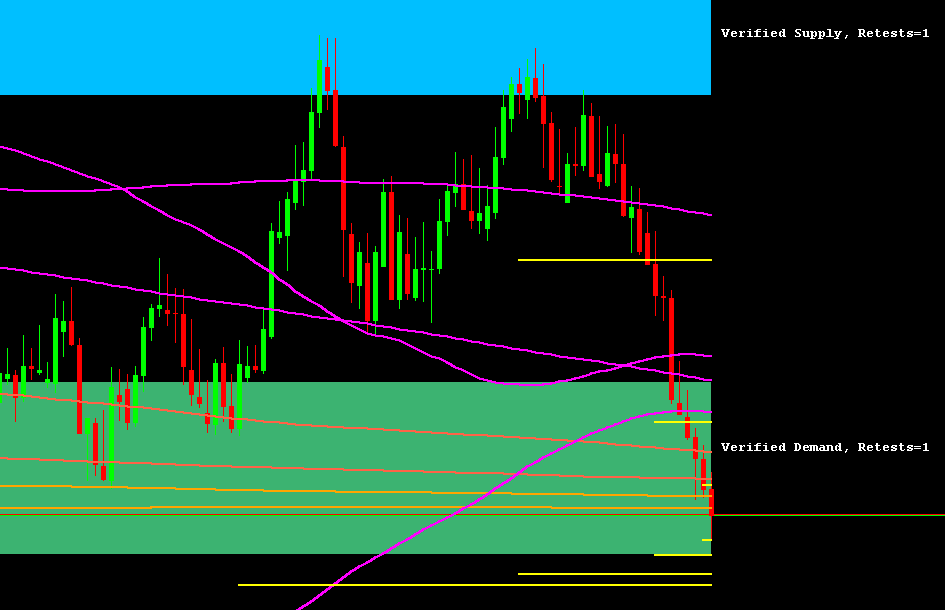

#### SMA Lines
- **M1-M5**: Orange lines
- **M15-M30**: Tomato lines
- **H1-W1**: Magenta lines
- **MN1 100 SMA**: Plotted as reference (does not block dashboard on symbols with < 100 monthly bars)

#### Power Scoring Dashboard

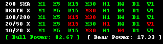
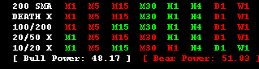

Each timeframe contributes signals worth 5 points:
- Price above/below 200 SMA
- Death Cross / Golden Cross (50/200 SMA)
- 100/200 SMA cross
- 20/50 SMA cross
- 10/20 SMA cross

**LTF Power** (M1-M30) and **HTF Power** (H1-W1) each total 100 points maximum.

Writes `GlobalBullPowerHTF`, `GlobalBearPowerHTF`, `GlobalBullPowerLTF`, `GlobalBearPowerLTF` to GlobalVariables for EA consumption.

#### Settings

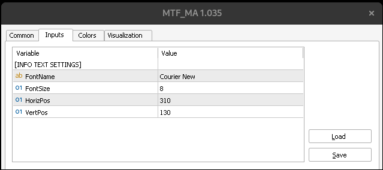
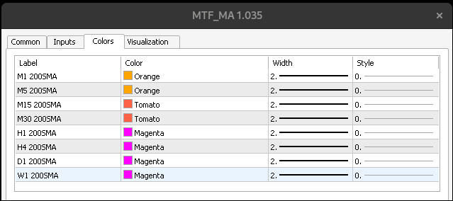

| Parameter | Default | Description |
|-----------|---------|-------------|
| FontName | Courier New | Dashboard font |
| FontSize | 8 | Dashboard font size |
| HorizPos | 310 | X position (pixels from corner) |
| VertPos | 0 | Y position |

---

### MultiKAMA — Multi Timeframe KAMA (v1.009)

Displays Kaufman Adaptive Moving Average for H1, H4, D1, W1, and MN1 timeframes simultaneously on the chart.

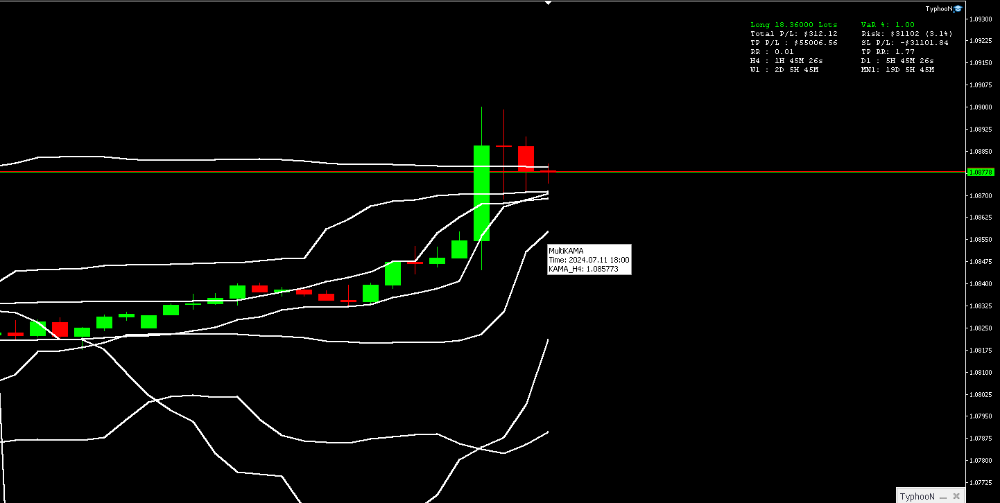

Writes GlobalVariables per timeframe:
- `IsAbove_KAMA_{TF}`: Whether current price is above (1.0) or below (0.0) the KAMA
- `recent_KAMA_{TF}`: The current KAMA value (updated on new bar only, with change detection)

| Parameter | Default | Description |
|-----------|---------|-------------|
| InpPeriodAMA | 10 | AMA period |
| InpFastPeriodEMA | 2 | Fast EMA smoothing period |
| InpSlowPeriodEMA | 30 | Slow EMA smoothing period |

---

### KAMA — Kaufman Adaptive Moving Average (v1.03)

Single-timeframe KAMA indicator. Used internally by MultiKAMA via `iCustom()` handles. Based on MetaQuotes reference implementation with `pow(x,2)` replaced by `x*x` for performance.

| Parameter | Default | Description |
|-----------|---------|-------------|
| InpPeriodAMA | 10 | AMA period |
| InpFastPeriodEMA | 2 | Fast EMA period |
| InpSlowPeriodEMA | 30 | Slow EMA period |

---

### Ehlers Fisher Transform

Ehlers' Fisher Transform oscillator. Plots the Fisher value and signal line with color-coded histogram (green = bullish, red = bearish).

Writes `FisherBias` GlobalVariable:
- `+1.0` when Fisher > Signal (bullish)
- `-1.0` when Fisher < Signal (bearish)
- `0.0` when equal

| Parameter | Default | Description |
|-----------|---------|-------------|
| inpPeriod | 32 | Lookback period |
| inpCalcMode | calc_no | Whether to include current H/L |
| inpPrice | PRICE_MEDIAN | Applied price type |

---

### BetterVolume — Volume Classification

Volume classification histogram ported from the original EasyLanguage source by Emini-Watch. Classifies each bar's volume using estimated buying/selling pressure into actionable categories.

| Color | Classification | Meaning |
|-------|---------------|---------|
| SteelBlue | Normal | Unremarkable volume |
| Yellow | Low Volume | Lowest volume in lookback — potential breakout setup |
| Red | Climax Up | Highest buying pressure x range — potential reversal/exhaustion |
| White | Climax Down | Highest selling pressure x range — potential reversal/exhaustion |
| Green | Churn | Highest volume/range ratio — accumulation/distribution |
| Magenta | Climax + Churn | Both climax and churn conditions met |

Buy/sell volume is estimated from OHLC data since MQL5 lacks uptick/downtick data.

| Parameter | Default | Description |
|-----------|---------|-------------|
| InpLookback | 20 | Lookback period for extremes |
| InpUse2Bars | true | Enable 2-bar combined analysis |
| InpShowAvg | false | Show average volume SMA line |
| InpAvgPeriod | 20 | Average volume SMA period |
| InpVolumeType | VOLUME_TICK | Tick or real volume |

---

### SupplyDemand — Supply and Demand Zones

Chart-window supply and demand zone indicator using fractal-based detection with body-to-wick zone boundaries. Zones are drawn as colored rectangles with strength classification based on touch count.

| Zone Type | Boundary | Description |
|-----------|----------|-------------|
| Supply (Resistance) | Hi = High, Lo = Min(Close, Open) | Body-to-wick of fractal high bar |
| Demand (Support) | Hi = Max(Close, Open), Lo = Low | Body-to-wick of fractal low bar |

**Zone Strength (4-tier):**
- **Untested** (0 touches) — freshest zone, highest probability
- **Tested** (1-2 touches) — zone has been tested
- **Proven** (3+ touches) — well-established zone
- **Broken** (close beyond boundary) — zone invalidated

| Parameter | Default | Description |
|-----------|---------|-------------|
| InpFractalLookback | 5 | Bars each side for fractal detection |
| InpBackLimit | 1000 | Max history bars to scan |
| InpShowBroken | false | Show broken zones (grayed out) |
| InpMergeZones | true | Merge overlapping same-type zones |
| InpShowLabels | true | Show Supply/Demand labels on zones |

---

### ATR Projection (v1.052)

Projects ATR (Average True Range) as horizontal lines above and below the current candle open for M15, H1, H4, D1, W1, and MN1 timeframes.

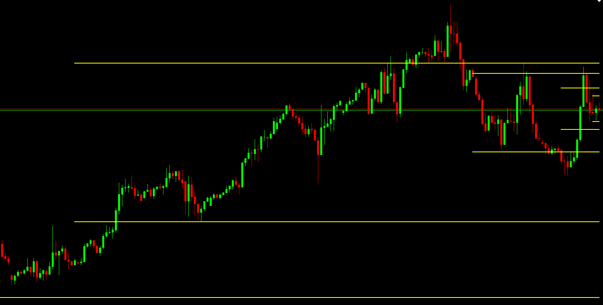
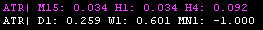

InfoText turns **magenta** when lower timeframe ATR exceeds higher timeframe ATR (volatility expansion signal).

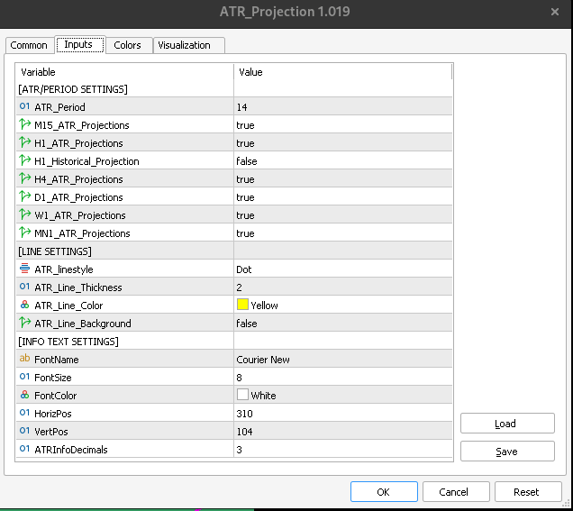

| Parameter | Default | Description |
|-----------|---------|-------------|
| ATR_Period | 14 | ATR calculation period |
| M15/H1/H4/D1/W1/MN1_ATR_Projections | true | Enable per-timeframe |
| ATR_linestyle | STYLE_DOT | Line style |
| ATR_Line_Thickness | 2 | Line width (pixels) |
| ATR_Line_Color | clrYellow | Line color |
| ATR_Line_Background | true | Draw behind other objects |

---

### Previous Candle Levels (v1.056)

Draws horizontal lines at the high and low of previous candles across H1 through MN1 timeframes. Lines begin at the previous candle and extend to the current candle, updating as new candles form.

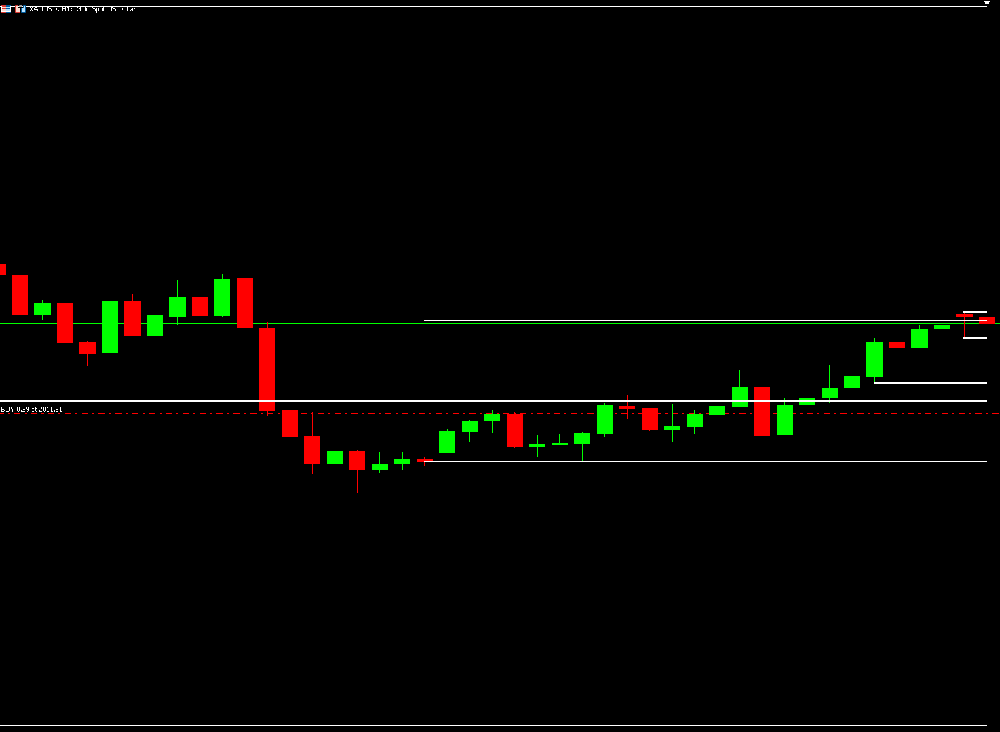

- **White lines**: Standard previous candle high/low (H1, H4, D1, MN1)
- **Magenta lines**: Special session levels — Asian H/L, London H/L, W1 H/L, current D1 H/L ("Judas Swing")
- LTF levels are automatically hidden on higher timeframes where they would not be visible.

---

### FakeCandle (v1.05)

Draws a user-defined candlestick on the chart as a visual overlay. Useful for planning trades or marking projected levels.

| Parameter | Default | Description |
|-----------|---------|-------------|
| FakeHigh | 1.0 | Candle high price |
| FakeLow | 0.5 | Candle low price |
| FakeOpen | 0.8 | Candle open price |
| FakeClose | 0.75 | Candle close price |

---

## Include Libraries

### `DWEX Portfolio Risk Man.mqh` (v1.04)
Darwinex Portfolio Risk Management module. Provides VaR (Value at Risk) calculations using historical return standard deviation and inverse cumulative normal distribution. Used by both TyphooN and TyAlgo EAs for position sizing.

### `RiskCalc.mqh`
Orchard Forex risk calculation utilities:
- `NewBar()` — Detects new bar formation with configurable timeframe
- `DoubleToTicks()` — Converts price distance to tick count
- `RiskLots()` — Calculates lot size from risk amount and SL distance

### `SignalSlots.mqh`
TyAlgo modular signal slot system. Contains enums, structs, and init/read/deinit functions for the Baseline, Confirmation, Volume, and Exit slots. See [TyAlgo Signal Slot Architecture](#signal-slot-architecture).

---

## Installation

1. Copy `Experts/*.mq5` to your MT5 `MQL5/Experts/` directory.
2. Copy `Indicators/*.mq5` (and `.mq4` / `.mqh` files) to `MQL5/Indicators/`.
3. Copy `Include/` subdirectories to `MQL5/Include/` preserving the folder structure:
   - `Include/Darwinex/` → `MQL5/Include/Darwinex/`
   - `Include/Orchard/` → `MQL5/Include/Orchard/`
   - `Include/TyAlgo/` → `MQL5/Include/TyAlgo/`
4. Compile all `.mq5` files in MetaEditor.
5. Attach indicators to your chart first (MultiKAMA, EhlersFisherTransform, MTF_MA, BetterVolume, SupplyDemand).
6. Then attach the EA (TyphooN or TyAlgo).
7. Ensure "Allow Algo Trading" is enabled in Common tab.

---

## Deployment

The included `deploy.sh` script copies all source files to multiple MT5 installations:

```bash
./deploy.sh
```

It scans for `~/.mt5_*/` directories (Wine-based Darwinex MetaTrader 5 installations) and copies:
- Expert Advisors → `MQL5/Experts/`
- Indicators (`.mq5`, `.mq4`, `.mqh`) → `MQL5/Indicators/`
- Include files → `MQL5/Include/` (preserving subdirectory structure)

Files are only copied when they differ from the destination (`cmp -s` check), minimizing unnecessary writes.

---

## Cross-Platform Support

All homegrown TyphooN indicators support both MQL5 and MQL4 via the shared `.mqh` pattern:

```
IndicatorName.mq5  ─┐
                     ├── #include "IndicatorName.mqh"  (shared logic)
IndicatorName.mq4  ─┘
```

Platform-specific code uses `#ifdef __MQL5__` / `#ifdef __MQL4__` preprocessor guards. The `.mq5` and `.mq4` files are thin wrappers setting `#property` directives and plot properties, while `.mqh` contains all logic.

**Cross-platform indicators (MQL5 + MQL4):** MTF_MA, MultiKAMA, KAMA, EhlersFisherTransform, BetterVolume, SupplyDemand, ATR_Projection, PreviousCandleLevels, FakeCandle.

**MQL5-only components:** TyphooN EA, TyAlgo EA, and all third-party NNFX/Ehlers indicators in `Indicators/NNFX/` and `Indicators/Ehlers/`. Third-party and NNFX indicators will not be converted to MQL4.

---

## License

Released under the [GNU General Public License v3](https://www.gnu.org/licenses/quick-guide-gplv3.html). You are free to use, change, or share the software for any purpose as long as modified versions remain free. See [LICENSE](LICENSE) for the full text.

## Terms of Use

By using this software, you understand and agree that we (company and author) are not liable or responsible for any loss or damage due to any reason. Although every attempt has been made to assure accuracy, we do not give any express or implied warranty as to its accuracy. We do not accept any liability for error or omission.

You acknowledge that you are familiar with these risks and that you are solely responsible for the outcomes of your decisions. We accept no liability whatsoever for any direct or consequential loss arising from the use of this product. You understand and agree that past results are not necessarily indicative of future performance.

## Disclaimer and Risk Warnings

Trading any financial market involves risk. All forms of trading carry a high level of risk so you should only speculate with money you can afford to lose. You can lose more than your initial deposit and stake. Please ensure your chosen method matches your investment objectives, familiarize yourself with the risks involved and if necessary seek independent advice.

**Do not invest money you cannot afford to lose.**

CFTC RULE 4.41 — HYPOTHETICAL OR SIMULATED PERFORMANCE RESULTS HAVE CERTAIN LIMITATIONS. UNLIKE AN ACTUAL PERFORMANCE RECORD, SIMULATED RESULTS DO NOT REPRESENT ACTUAL TRADING. ALSO, SINCE THE TRADES HAVE NOT BEEN EXECUTED, THE RESULTS MAY HAVE UNDER-OR-OVER COMPENSATED FOR THE IMPACT, IF ANY, OF CERTAIN MARKET FACTORS, SUCH AS LACK OF LIQUIDITY. SIMULATED TRADING PROGRAMS IN GENERAL ARE ALSO SUBJECT TO THE FACT THAT THEY ARE DESIGNED WITH THE BENEFIT OF HINDSIGHT. NO REPRESENTATION IS BEING MADE THAT ANY ACCOUNT WILL OR IS LIKELY TO ACHIEVE PROFIT OR LOSSES SIMILAR TO THOSE SHOWN.

---

Copyright 2023 - [MarketWizardry.org](https://www.marketwizardry.org/) - All Rights Reserved
