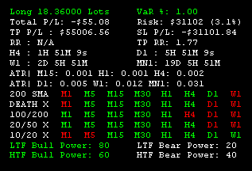
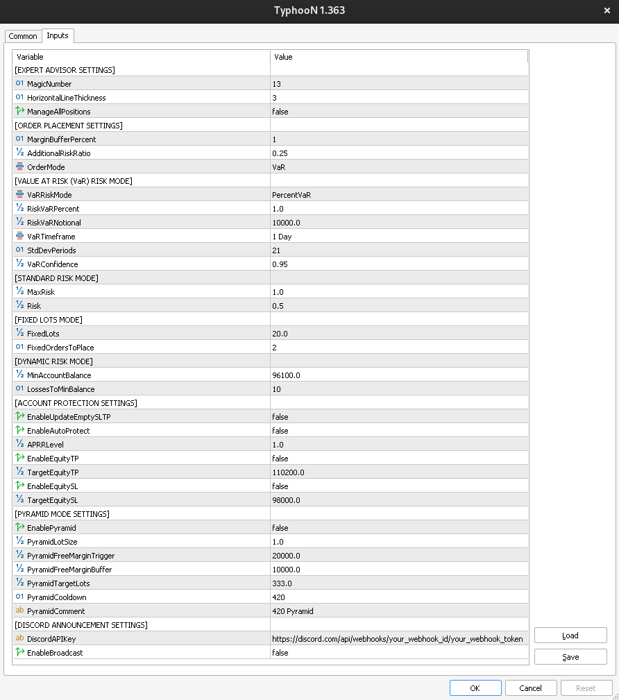
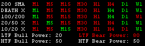

# Discord Market Wizardry Community / Darwinex Zero Coupon Code
- Join my Discord community for support with my EA and indicators, and also share trading ideas at http://marketwizardry.info/
- Use the coupon code DWZ2314896MGM at checkout for Darwinex Zero for a €10 discount!

# TyphooN's MQL5-Risk_Management_System (Expert)

## Risk Management System Settings

### Common Tab
- Allow Algo Trading must be checked for the expert to place trades.

### EXPERT ADVISOR SETTINGS
- MagicNumber: Can be set to anything the user wants, but this expert will only modify trades/positions that match the MagicNumber on the chart.
- HorizontalLineThickness: The width in pixels that the SL, TP, and Limit lines are drawn with.
- ManageAllPositions: This is set to false by default, which will only manage positions that have been opened by the EA's MagicNumber.  If ManageAllPositions is set to true, will manage all positions on a symbol regardless of MagicNumber.

### ORDER PLACEMENT SETTINGS
- MarginBufferPercent: The percent of buffer in margin that will not be used for placing orders.
- AdditionalRiskRatio: The multiplier to risk when adding additional lots when  SL Break Even is detected (Standard / Dynamic risk modes only).

### VALUE AT RISK (VaR) RISK MODE
- VaRRiskMode: PercentVaR or NotionalVaR
- RiskVaRPercent: Percent of Account Equity to use for target VaR % when VarRiskMode is set to PercentVaR.
- RiskVaRNotional: Notional VaR (Value at Risk) to use for order placement when VaRRiskMode is set to NotionalVaR.
- VaRTimeframe: Timeframe to use for VaR (Default D1)
- StdDevPeriods: # of periods to use for StdDev (Default 21)
- VaRConfidence: 0.95 (Percent Confidence for VaR)
- Note: All Default VaR values are based on Darwinex 95% confidence over 21 days.

### STANDARD RISK SETTINGS
- UseStandardRisk: Use standard Risk mode (user defined MaxRisk / Risk)
- MaxRisk (Standard Mode): Maximum percentage of risk across the symbol, once this level is hit no more orders will be placed.
- Risk(Standard Mode): The % of the account that is being risked every time "Open Trade" is clicked.

### DYNAMIC RISK SETTINGS
- UseDynamicRisk: Use Dynamic Risk Mode.  In Dynamic Risk Mode, Risk = (Balance - MinimumAccountBalance) / LossesToMinBalance.
- MinAccountBalance: The Minimum account balance used to calculate Dynamic Risk.
- LossesToMinBalance: The number of losses required to reach the MinAccountBalance.

### ACCOUNT PROTECTION SETTINGS
- EnableAutoProtect will place stop loss(es) at break even when RR passes AutoProtectRRLevel and risk > 0.  This will only happen once per market, and will not happen again if SL is set to break even on any position for that symbol.  (Default: false)
- AutoProtectRRLevel is the Reward:Risk level that will trigger AutoProtect.
- EnableEquityTP: Will close all open positions on the account when Equity >= TargetEquityTP.
- TargetEquityTP: The Equity value of the account that EquityTP will be triggered by.
- EnableEquitySL: Will close all open positions on the account when Equity < TargetEquitySL.
- TargetEquitySL: The Equity value of the account that EquitySL will be triggered by.

### PYRAMID MODE SETTINGS
- EnablePyramid: Enable or disable Pyramid Mode.  When enabled, it will buy PyramidLotSize when FreeMargin >= PyramidFreeMarginTrigger until PyramidFreeMarginBuffer is hit.
- PyramidLotSize:  How many lots to buy when Pyramid mode is triggered.
- PyramidFreeMarginTrigger: Free Margin Trigger.
- PyramidFreeMarginBuffer: Amount of Margin to leave as buffer after placing orders with Pyramid mode.
- PyramidTargetLots:  Pyramid mode will open new lots until PyramidTargetLots is hit.
- PyramidCooldown: Number of seconds to cooldown before placing Pyramid orders again.
- PyramidComment:  Comment to add to Pyramid placed orders.

### DISCORD ANNOUNCEMENT SETTINGS
- DiscordAPIKey: Must be set to a user's discord API key (webhook) prior to use.
- EnableBroadcast: Enable the Discord Opened Position / Limit Order Announcement (default false).

### Risk Management Panel
- Open Trade: Will default to market execution unless Limit Line is clicked first.  The order is placed with TP and SL parameters set to the levels of the TP Line (Green Line) and the SL Line (Red line).  Both of these lines can be double clicked and moved by the user to the desired price.
- Buy Lines: Creates TP and SL Lines in the buy orientation.  If existing positions are on the symbol, SL and TP lines will lock to the values in an existing order.
- Destroy Lines: Removes TP and SL line from chart, so that the user may not accidentally place or modify an order.
- Close All: Closes all open positions/limit orders on the market.
- Set TP: Modifies the take profit level of existing trades on the symbol to the price at the TP Line (Green Line).
- Limit Line: Creates a white line which is where the limit order will be placed.
- Sell Lines: Creates TP and SL Lines in the sell orientation. If existing positions are on the symbol, SL and TP lines will lock to the values in an existing order.
- Protect: Moves stop loss to break even on all positions of the current symbol.  This will disable AutoProtect.
- Close Partial: Closes the smallest lot order on the current symbol.
- Set SL: Modifies the take profit level of existing trades on the symbol to the price at the SL Line (Red Line).

### Risk Management InfoText
- Total P/L: Current running Profit/Loss on the current symbol.
- Total TP: The amount of profit that will be realized if TP price is hit.
- Risk: The amount of risk on the current symbol.
- SL Profit: How much P/L will be taken at SL.
- RR: Current trade Reward/Risk ratio.
- TP RR: Reward/Risk ratio if price hits TP.
- H4 - MN1: The amount of time until the next candlestick of that time period will print.

# TyphooN's Multi Timeframe MA Bull/Bear Power Indicator (MTF_MA)
- Plots 200 SMA lines across all timeframes M1 -> W1 onto the chart.  M1 -> M5 are Orange coloured lines. M15 -> M30 are Tomato coloured lines.  H1 -> W1 timeframes are Magenta coloured lines.  The colours used are easily visible in contrast to the colours used in the supporting indicators.
- The SMA crossovers and levels used are as follows (and displayed in the infotext):
  - 200 SMA (whether price is above or below the level for the timeframe).
  - DEATH X: 50/200 SMA aka Death Cross / Golden Cross.
  - 100/200: 100/200 SMA cross.
  - 20/50: 20/50 SMA cross.
  - 10/20: 10/20 SMA cross.
- Bear Power and Bull Power are based on a scoring system which scores several SMA crossovers across all timeframes M1 -> W1 (Total Power is always 100 for both LTF and HTF).  LTF Power is based on M1 -> M30 signals.  HTF Power is based on H1 -> W1 signals.  Each signal is worth 5 points currently (subject to change).

## MTF_MA Indicator Settings

### Info Text Settings
- FontName: The Font to draw InfoText with.
- FontSize: Font Size to use when drawing InfoText.
- HorizPos: Horizontal position in pixels where the InfoText will appear.
- VertPos : Vertical position in pixels where the InfoText will appear.

### TyphooN's Previous Candle Levels Indicator
- Draws white horizontal lines for Previous H1 -> MN1 candlesticks and updates them as new candlesticks print.
- The lines begin at the previous candlestick high and low, and end at the current candlestick.
- LTF levels are disabled on higher timeframes because they are not visible.
- Asian High/Low, London High/Low, W1 High/Low, and current D1 High/Low "Judas Swing" levels are drawn in magenta.

# TyphooN's ATR Projection Indicator
- The ATR Projection Indicator plots a yellow line +/- the ATR value (Projection) whenever a new candlestick forms on the enabled timeframe(s).  The length of the line indicates a longer timeframe.  Some timeframes are disabled when viewing higher timeframes as they are barely visible.
- The user can hover the mouse over the plotted lines to see what the timeframe is, and if it is the Projected ATR High or Low.
- InfoText is displayed on the chart which contains the M15, H1, H4, D1, W1, and MN1 ATR values for easy evaluation.
- InfoText will turn Magenta if a lower timeframe ATR >= a higher timeframe ATR.

## ATR Projection Indicator Settings
### ATR/PERIOD SETTINGS
- ATR_Period: How many bars are used to calculate the ATR.  14 is the standard ATR period and is the default.
- M15_ATR_Projections: Enables M15 ATR Projections if true (default true).
- H1_ATR_Projections: Enables H1 ATR Projections if true (default true).
- H4_ATR_Projections: Enables H4 ATR Projections if true (default true).
- D1_ATR_Projections: Enables D1 ATR Projections if true (default true).
- W1_ATR_Projections: Enables W1 ATR Projections if true (default true).
- MN1_ATR_Projections: Enables MN1 ATR Projections if true (default true).

### LINE SETTINGS
- ATR_linestyle: The style of line to draw (default Dot).
- ATR_Line_Thickness: The number of pixels thick that ATR Projection Lines will be drawn with.
- ATR_Line_Color: The Colour of the ATR Projection Lines.
- ATR_Line_Background: Enable to draw the ATR Lines in the background of other objects or not.

### INFO TEXT SETTINGS
- FontName: The Font to draw InfoText with.
- FontSize: Font Size to use when drawing InfoText.
- HorizPos: Horizontal position in pixels where the InfoText will appear.
- VertPos : Vertical position in pixels where the InfoText will appear.
- ATRInfoDecimals: The number of decimals to display in the ATR InfoText.

# Usage
This project is intended and may be freely used for education and entertainment purposes.
However, **this project is not suitable for live trading** without relevant knowledge.

# License
The project is released under [GNU GPLv3 licence](https://www.gnu.org/licenses/quick-guide-gplv3.html),
so that means the software is copyrighted, however you have the freedom to use, change or share the software
for any purpose as long as the modified version stays free. See: [GNU FAQ](https://www.gnu.org/licenses/gpl-faq.html).

You should have received a copy of the GNU General Public License along with this program
(check the [LICENSE](LICENSE) file).
If not, please read <http://www.gnu.org/licenses/>.
For simplified version, please read <https://tldrlegal.com/license/gnu-general-public-license-v3-(gpl-3)>.

## Terms of Use
By using this software, you understand and agree that we (company and author)
are not be liable or responsible for any loss or damage due to any reason.
Although every attempt has been made to assure accuracy,
we do not give any express or implied warranty as to its accuracy.
We do not accept any liability for error or omission.

You acknowledge that you are familiar with these risks
and that you are solely responsible for the outcomes of your decisions.
We accept no liability whatsoever for any direct or consequential loss arising from the use of this product.
You understand and agree that past results are not necessarily indicative of future performance.

Use of this software serves as your acknowledgement and representation that you have read and understand
these TERMS OF USE and that you agree to be bound by such Terms of Use ("License Agreement").

# Copyright information
Copyright © 2023 - MarketWizardry.org - All Rights Reserved

# Disclaimer and Risk Warnings
Trading any financial market involves risk.
All forms of trading carry a high level of risk so you should only speculate with money you can afford to lose.
You can lose more than your initial deposit and stake.
Please ensure your chosen method matches your investment objectives,
familiarize yourself with the risks involved and if necessary seek independent advice.

NFA and CTFC Required Disclaimers:
Trading in the Foreign Exchange market as well as in Futures Market and Options or in the Stock Market
is a challenging opportunity where above average returns are available for educated and experienced investors
who are willing to take above average risk.
However, before deciding to participate in Foreign Exchange (FX) trading or in Trading Futures, Options or stocks,
you should carefully consider your investment objectives, level of experience and risk appetite.
**Do not invest money you cannot afford to lose**.

CFTC RULE 4.41 - HYPOTHETICAL OR SIMULATED PERFORMANCE RESULTS HAVE CERTAIN LIMITATIONS.
UNLIKE AN ACTUAL PERFORMANCE RECORD, SIMULATED RESULTS DO NOT REPRESENT ACTUAL TRADING.
ALSO, SINCE THE TRADES HAVE NOT BEEN EXECUTED, THE RESULTS MAY HAVE UNDER-OR-OVER COMPENSATED FOR THE IMPACT,
IF ANY, OF CERTAIN MARKET FACTORS, SUCH AS LACK OF LIQUIDITY. SIMULATED TRADING PROGRAMS IN GENERAL
ARE ALSO SUBJECT TO THE FACT THAT THEY ARE DESIGNED WITH THE BENEFIT OF HINDSIGHT.
NO REPRESENTATION IS BEING MADE THAN ANY ACCOUNT WILL OR IS LIKELY TO ACHIEVE PROFIT OR LOSSES SIMILAR TO THOSE SHOWN.
